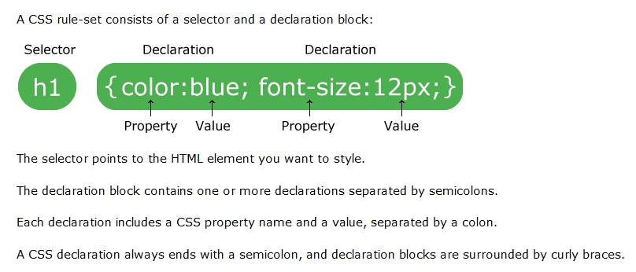

# css-ids-classes

## CSS specificity

### Voorrang stylesheets

Je hebt misschien wel eens gezien dat als je op twee plekken een zelfde CSS property toekent aan eenzelfde HTML element dat de regel die als **laatste** in het CSS document voorkomt geld.

```CSS
/* de achtergrondkleur van deze webpagina zal blauw zijn */
body{
    background-color: red;
}

body{
    background-color: blue;
}
````

Er zijn regels die aangeven welke CSS code wordt toegepast. In het kort gezegd, hoe specifieker / gerichter de CSS selector hoe meer voorrang deze krijgt bij het stylen van de pagina.

De ingebouwde stylesheet van je browser (De User Agent Stylesheets) die bijvoorbeeld de H1 t/m H6 een steeds kleiner wordende font-size geeft wordt overruled op het moment dat jij zelf een font-size geeft aan een H1 element in een gelinked stylesheet. Wat jij aan CSS code schrijft is veel *gerichter* dan de algemene styles van de browser.

De volgorde zoals de browser die aanhoudt wat betreft stylesheets is als volgt:

1. Ingebouwde browser stylesheet (User Agent Stylesheets)
    - Deze styles gelden voor iedereen die de browser gebruikt
2. Jouw geschreven CSS code als designer van een website (Author Stylesheets)
    - Deze styles gelden voor iedereen die op jouw website komt
3. Styles die je kan veranderen die alleen voor jouw browser gelden (User Stylesheets)
    - Deze styles gelden alleen voor website(s) die jij bezoekt in jouw browser

Je ziet dat de verschillende stylesheets een steeds specifiekere groep gebruikers raakt. Dus als twee CSS regels elkaar tegenspreken dan wordt de meest specifieke regel toegepast. Dus als de browser onderstaande code tegenkomt in de verschillende stylesheets dan zal de h1 font-size worden ingesteld op 50px;

```CSS
/* CSS in User Agent Stylesheet, meegegeven door de browser zelf */
h1{
    font-size: 80px;
}

/* CSS in Author Stylesheet, b.v. style.css */
h1{
    font-size: 50px;
}
```

### Voorang Selectors

Ook Selectors hebben specificiteit. Weet je nog, de Selector in een CSS regel geeft aan op welk HTML element de styles moeten worden toegepast. Zie plaatje hieronder voor een korte opfrissing.



De Selector kan natuurlijk ook een ID of Class zijn. Hierboven wordt h1 gebruikt als selector, dit noem je een Element Selector want hij slaat direct op een HTML element. De volgorde waarin de CSS styles worden toegepast van heel algemeen naar steeds specifieker is als volgt:

1. Element Selectors (h1, p, div, header, etc)
    - Slaat op alle elementen van een bepaald type in het hele document.
2. Class selectors (.mijnClass)
    - Slaat alleen op elementen die een bepaalde Class hebben (class="mijnClass") als HTML atribuut. Een Class zoals .mijnClass kan aan meerdere elementen in hetzelfde HTML document worden toegevoegd.
3. Id selectors (#mijnId)
    - Slaat alleen op 1 element binnen een HTML document, een Id mag maar één keer voorkomende in je HTML document.

Je kan als je wilt een bereking uitvoeren om de specificity van een selector te berekenen. Zie de SpeciFISHity link als je wilt zien hoe dat werkt.

Voor nu gaan we ons alleen bezig houden met Element Selectors en gaan we kijken hoe ook alleen met het gebruik van Element Selectors heel specifiek een enkel HTML element kan worden gestyld. Kijk in de tabel hieronder om te zien hoe dat werkt.

Selector | Spreekt welk(e) HTML element(en) aan
---------| ------------------------------------
*| Alle HTML elementen op een pagina
div | alle div elementen op een pagina
h1, h2 | Alle h1 en h2 elementen op een pagina
main h1 | Alle h1 elementen die ***in*** het main element zitten
main > h1 | Alleen de kopteksten die directe afstammelingen zijn van main
h1 + h2 | Alleen het eerste h2 element dat meteen volgt op een h1 element
h1 ~ h2 | Alle h2 elementen die volgen op een h1 element

### Opdracht

Maak voor onderstaande taken telkens per taak één CSS regel aan met dus één selector. Maak geen aanpassingen in het HTML document en voeg telkens de nieuwe CSS regel toe onder de al bestaande CSS regels tenzij anders wordt gezegd. Kijk wel goed bij index.html hoe het document is opgebouwd.


- [x] Als je een van de onderstaande taken hebt afgerond zet dan in README.md een 'x' tussen de [ ]. In je repository wordt dan bij de opdracht de taak afgevinkt.
- [x] 1. Geef de header, main en footer een width van 100%
- [x] 2. Geef de header en footer een height van 20%
- [ ] 3. Geef de main een height van 80% en een achtergrondkleur naar keuze
- [x] 4. Pas de header, footer CSS regel aan, voeg een achtergrondkleur naar keuze toe
- [x] 5. Geef alleen het logo in de header een margin van 20px
- [x] 6. Geef alleen het logo in de main een width van 400px
- [x] 7. Geef alleen het logo in de footer een border van 1px solid black

- [x] 8. Maak van de nav in de header en de ul in die nav een flexbox container: (display:flex;) gebruik 1 CSS regel en Zorg ervoor dat het menu in de footer géén flexbox container wordt.
- [x] 9. Geef links van het menu in de header een padding van 20px;
- [x] 10. Haal bij alle links die in een nav zitten de underline weg (text-decoration: none)

- [x] 11. Haal bij de undordered lists in de header en footer de bullets weg (list-style-type:none;)

- [x] 12. Geef alle h1 elementen die direct afstammen van een div een font-size vanm 50px en een achtergrondkleur naar keuze
- [x] 13. Geef alle list items die direct afstammen van een ul een border van 1px dashed black
- [x] 14. Geef alle paragrafen die na een h3 koptekst komen een ander lettertype naar keuze (font-family: ...)
- [ ] 15. Geef alle unordered lists die die volgen op een img element een color naar keuze en een list style type van circle (list-style-type: circle)

### Links

[SpeciFISHity](https://specifishity.com/)

[CSS Diner](https://flukeout.github.io/)

[Overzicht W3schools van CSS Selectors](https://www.w3schools.com/cssref/css_selectors.asp/)
